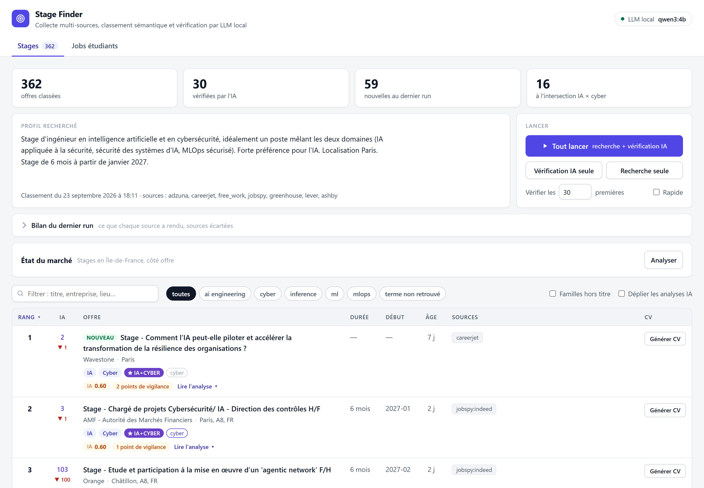
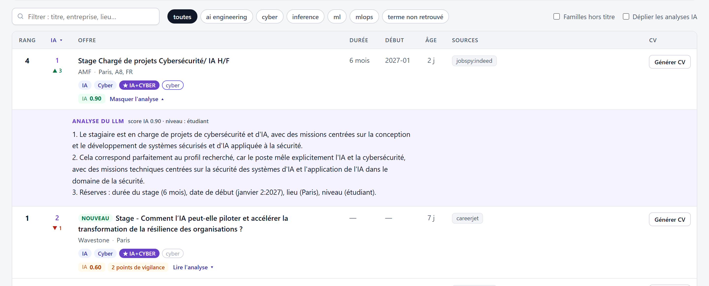

# stage-finder

[](https://github.com/EnzoPro1/stage-finder/actions/workflows/tests.yml)


Agrégateur **local** d'offres de **stage** (IA, ML, cybersécurité, en
Île-de-France) et de **jobs étudiants**. Il interroge une dizaine de sources en
parallèle, dédoublonne, **classe par similarité sémantique** avec un profil
idéal, puis fait **relire la shortlist par un LLM local** qui explique son
verdict. Le tout se pilote depuis une petite app web Flask.

Tout tourne sur la machine : embeddings et LLM via [Ollama](https://ollama.com),
aucune offre ni aucun profil n'est envoyé à un service d'IA externe.

<picture>
  <source media="(prefers-color-scheme: dark)" srcset="docs/captures/app-sombre.png">
  
</picture>

---

## Points techniques

- **Collecte multi-sources résiliente.** APIs (Adzuna, France Travail en OAuth2,
  Careerjet, Free-Work), scraping sans compte via JobSpy (Indeed, LinkedIn),
  pages carrières d'entreprises (Greenhouse, Lever, Ashby). Sources API en
  parallèle ; une source en panne n'interrompt jamais le run, et un **bilan par
  source** dit ce que chacune a réellement rendu et pourquoi elle a pu rester
  muette ([observabilite.py](observabilite.py)).
- **Déduplication en deux temps** : exacte (hash titre normalisé + entreprise +
  ville), puis floue par embeddings pour les quasi-doublons.
- **Classement sémantique** : embeddings `bge-m3` via Ollama (repli automatique
  sur `paraphrase-multilingual-MiniLM-L12-v2` sans Ollama), plusieurs profils
  cibles agrégés, boosts par mots-clés et signaux souples (durée, date de début).
- **Vérification par LLM local** (`qwen3:4b`) : sortie JSON structurée et
  validée, garde-fous déterministes contre les faux positifs, cache des verdicts
  versionné par les règles du prompt.
- **Réglages mesurés, pas devinés** : corpus d'offres réelles étiqueté à
  l'aveugle, `precision@10` / `nDCG@10`, instantané de base figé pour des
  mesures reproductibles, comparaison de modèles d'embeddings et de LLM.
- **Jobs étudiants** : temps de trajet réels (OpenRouteService) depuis plusieurs
  origines, avec repli explicite sur une estimation.
- **Génération de CV en tâche de fond** : file SQLite, worker unique protégé par
  un verrou inter-processus relâché par l'OS si le processus meurt.
- **Qualité** : plus de 1 000 tests `pytest` (réponses de sources figées, LLM
  simulé), configuration validée par pydantic au démarrage, secrets masqués
  dans les logs.

## Pipeline

```
Sources → Normalisation → Filtres durs → Extraction → Déduplication (exacte + floue)
        → Ranking sémantique → Vérification LLM → Persistance SQLite → App web / rapport HTML / CSV
```

| Étape | Rôle |
|---|---|
| **Sources** | Catalogue dans [sources/registry.py](sources/registry.py) : une source = une ligne. `config.SOURCES_ACTIVES` choisit celles qui tournent, et chaque source retirée l'est avec sa raison, imprimée au bilan. |
| **Normalisation** | Schéma commun `title, company, location, description, url, source, posted_at, salary`. |
| **Filtres durs** | Mot « stage » dans le titre, exclusion alternance / sénior, Île-de-France, offres récentes. Volontairement permissifs : le classement fait le tri fin. |
| **Extraction** | Durée du stage et date de début, lues dans le texte libre. |
| **Déduplication** | On garde la version la plus riche de chaque offre. |
| **Ranking** | Similarité cosinus avec les profils de référence, plus boosts IA / cyber / combo. |
| **Vérification** | Le LLM juge le *poste* (pas l'employeur) et rend un score, des drapeaux et une analyse. |

---

## Démarrage rapide

**Prérequis** : Python 3.11 ou 3.12 (pas 3.13+ : `torch` et `python-jobspy`
n'y ont pas encore de wheels). [Ollama](https://ollama.com) est facultatif :
sans lui, le classement se replie sur MiniLM et la vérification LLM est
désactivée.

```bash
git clone https://github.com/EnzoPro1/stage-finder.git
cd stage-finder
python -m venv .venv
# Windows : .venv\Scripts\activate    macOS / Linux : source .venv/bin/activate
pip install -r requirements.txt
cp .env.example .env          # puis renseigner les clés voulues (voir plus bas)
```

Pour la vérification LLM et les embeddings `bge-m3` :

```bash
ollama pull qwen3:4b
ollama pull bge-m3
```

Puis :

```bash
python app.py                 # app web sur http://localhost:5000
```

> Sans Ollama, la première exécution télécharge le modèle MiniLM (~470 Mo)
> depuis HuggingFace, une seule fois.

---

## Clés API

Copier `.env.example` en `.env`. **Une clé absente désactive simplement la
source concernée** (un avertissement est loggé, rien ne plante).

| Source | Variables | Obtention |
|---|---|---|
| Adzuna | `ADZUNA_APP_ID`, `ADZUNA_APP_KEY` | https://developer.adzuna.com/ (gratuit) |
| France Travail | `FRANCE_TRAVAIL_ID`, `FRANCE_TRAVAIL_KEY` | https://francetravail.io/ (gratuit) |
| Careerjet | `CAREERJET_AFFID` (facultatif) | https://www.careerjet.fr/partners/ |
| OpenRouteService | `ORS_API_KEY` (facultatif) | https://openrouteservice.org/ (gratuit) |
| Free-Work, JobSpy, Greenhouse, Lever, Ashby | aucune | — |

Quelques détails qui ont compté :

- **France Travail** : authentification OAuth2 `client_credentials`. La clé
  secrète ne transite jamais en query string, elle sert à obtenir un jeton
  envoyé en en-tête `Authorization: Bearer`. L'API limite à 5 départements par
  recherche (on filtre donc par région) et à 10 appels par seconde (le module
  sérialise ses requêtes, avec une marge à 8/s). Le panneau « État du marché »
  demande en plus les scopes ROMEO et Marché du travail.
- **Careerjet** fonctionne sans identifiant avec celui de démonstration de sa
  documentation, partagé et donc soumis à un quota commun.
- **JobSpy** scrape **sans authentification**, un site à la fois, avec des
  délais entre requêtes. Un blocage ponctuel est géré et n'arrête pas le reste.

---

## Configuration

| Fichier | Contenu |
|---|---|
| [config.py](config.py) | Profil idéal (`REQUETE_REFERENCE`, `PROFILS_REFERENCE`), sources actives, filtres, modèle d'embeddings, poids du score, réglages de la vérification LLM. Validé au démarrage par [config_schema.py](config_schema.py). |
| [recherche.yaml](recherche.yaml) | Termes de recherche par **famille** (ai_engineering, ml, mlops, inference, cyber), paramètres des jobs étudiants, liste des pages carrières suivies. |
| `recherche.local.yaml` | Surcharges propres au poste, **non versionnées** : typiquement les origines réelles des jobs étudiants (domicile). Même structure que `recherche.yaml`, fusionnée par-dessus. |
| `.env` | Clés API, et surcharges facultatives `SF_*` des réglages Ollama et des chemins de génération de CV (voir `.env.example`). |

Une configuration incohérente (poids négatif, seuil > 1, liste vide, famille
inconnue…) arrête le programme avec un message clair au lieu de produire un
classement silencieusement faussé.

---

## Utilisation

### App web

```bash
python app.py
```

Le classement cosinus s'affiche immédiatement (depuis le cache disque). Un clic
enchaîne la recherche sur toutes les sources puis la vérification IA du top N.
La colonne « IA » donne le rang après vérification et le mouvement par rapport
au rang sémantique (▲ / ▼) ; l'analyse rédigée par le LLM se déplie sous
chaque offre.

### Ligne de commande

```bash
python main.py                     # pipeline complet : console + CSV + rapport HTML
python main.py --limit 20          # top 20 en console
python main.py --no-jobspy         # sans scraping (APIs seules, rapide)
python main.py --no-verify         # classement cosinus seul, sans LLM
python main.py --min-score 0.4     # offres au score >= 0.40
python main.py --new-only          # offres jamais vues
python main.py --jobs-etudiants    # jobs étudiants autour des origines
```

Sorties : console, `stages.csv` (ouvrable dans Excel), `flux.html` (rapport
unifié stages + jobs étudiants, filtrable) et `stages.db` (historique des runs
et repérage des nouveautés).

### Tester une source isolément

```bash
python -m sources.adzuna
python -m sources.france_travail
python -m sources.careerjet
python -m sources.jobspy_source
python -m ranker                   # démo du ranking sur deux offres factices
python -m verifier                 # démo d'un verdict LLM (Ollama requis)
```

---

## Vérification LLM et faux positifs



Trois garde-fous dans [verifier.py](verifier.py), issus d'un cas réel : un
« Legal intern » publié par un éditeur de cybersécurité était noté **0.90**.

1. **Extraction centrée sur les missions.** Le modèle reçoit la section
   « missions » de l'annonce, pas son début : sur un run complet, 24 annonces
   sur 76 plaçaient leurs missions au-delà des 600 premiers caractères, et le
   modèle ne lisait que la présentation de l'entreprise.
2. **Règle de prompt explicite** : juger le *poste*, pas l'*employeur*.
3. **Garde-fou déterministe** : un métier support annoncé dans le titre
   (juridique, RH, vente…) plafonne le score, sauf si le titre porte aussi un
   signal IA ou cyber. Les termes ambigus sont écrits en expressions, jamais en
   mots isolés (« talent » seul attrapait « STAGE TALENT DAY »).

Résultat sur le top 12 : « Legal intern » passe de 0.90 à 0.30 avec un drapeau
explicite, les 9 offres techniques gardent leur score. Le cache des verdicts
est indexé par `verifier.VERSION_REGLES` : durcir le prompt invalide bien les
anciens jugements.

Conception détaillée : [docs/SPEC_verification_llm.md](docs/SPEC_verification_llm.md).

---

## Évaluer le classement

```bash
python etiqueter.py                # étiquette à l'aveugle des offres réelles de stages.db
python evaluer_ranking.py          # precision@10, nDCG@10, rang médian des positives
python comparer_llm.py             # compare des modèles de vérification sur le corpus
python benchmark.py                # compare des modèles d'embeddings
```

Le corpus de référence est fait d'**offres réelles**, présentées sans source,
sans score et sans rang, dans un ordre mélangé à graine fixe. La vérité vit
dans [etiquettes.json](etiquettes.json), versionné. Les jugements recueillis
*en voyant* le classement (retours dans l'app) sont stockés à part et **ne
peuvent pas** entrer dans le corpus de mesure : `tests/test_etancheite.py`
échoue si cette barrière saute.

`evaluer_ranking.py` est strictement déterministe : deux exécutions
consécutives produisent une sortie identique octet pour octet.

---

## État du marché

Le panneau « État du marché » de l'app répond à une autre question : *est-ce
le bon moment, et ma niche recrute-t-elle ?* Il compte les offres **par métier
(code ROME)** plutôt que par mot-clé, via l'IA ROMEO de France Travail : la
requête libre « stage cybersécurité » remonte 0 offre sur 31 jours en IdF, le
code ROME M1856 en remonte 9. Il ajoute le rythme de publication récent et
l'indicateur officiel de tension de recrutement ([market.py](market.py)).

```bash
python -m market
```

---

## Génération de CV

Chaque offre de l'app porte un bouton **« Générer CV »**. Une génération prend
plusieurs minutes et monopolise Ollama : le clic **enfile un job**, un
**worker unique** le consomme, et la page suit l'avancement. Le même code se
pilote sans Flask :

```bash
python cv_cli.py etat              # la file et la couverture en texte
python cv_cli.py batch             # les offres les mieux classées, puis consomme
python cv_cli.py travailler        # worker continu
```

> **Dépendance privée.** La génération elle-même est déléguée à `cv_forge`,
> un projet personnel séparé, non publié. Sans lui, tout le reste fonctionne ;
> seule une demande de CV répond par une erreur.

La dépendance est à sens unique (`stage-finder → cv_forge`) et passe par une
seule fonction, `generate_cv`. Le worker est protégé par une transaction
`BEGIN EXCLUSIVE` tenue sur un fichier dédié : un second processus (app web +
batch en même temps) sait qu'il n'est pas le bienvenu, et un worker tué ne
laisse aucun verrou orphelin.

---

## Tests

```bash
python -m pytest -q
```

Plus de 1 000 tests, exécutés en une trentaine de secondes, sans appel aux
sources ni à Ollama : chaque source est testée sur des réponses figées
([tests/fixtures/](tests/fixtures)), et le LLM est simulé. La CI GitHub Actions
les lance à chaque push.

---

## Structure du projet

```
stage-finder/
├── main.py                 # orchestrateur du pipeline (collecte parallélisée)
├── app.py                  # app web locale (Flask)
├── config.py               # critères de recherche, profils, poids, réglages
├── config_schema.py        # validation pydantic de la configuration (fail-fast)
├── recherche.py / .yaml    # familles de requêtes, jobs étudiants, pages carrières
├── sources/                # un module par source + registre + provenance
├── normalize.py            # schéma commun + normaliseurs par source
├── filters.py              # filtres durs
├── extract.py              # durée et date de début (signaux souples)
├── dedup.py                # déduplication exacte + floue
├── ranker.py               # classement sémantique multi-profils
├── llm.py                  # accès unique à Ollama (sorties structurées, embeddings)
├── verifier.py             # vérification LLM, verdict explicable
├── observabilite.py        # bilan par source et par famille de requêtes
├── jobs_etudiants.py       # collecte des jobs étudiants
├── communes.py, trajets.py # référentiel des communes, temps de trajet
├── storage.py              # persistance SQLite
├── rapport.py, report.py   # rapport HTML unifié, export CSV
├── market.py               # indicateurs « le marché est-il favorable ? »
├── etiqueter.py            # corpus étiqueté à l'aveugle
├── evaluer_ranking.py      # mesure du classement sur le corpus
├── comparer_llm.py         # comparaison de modèles de vérification
├── jobs.py, worker.py      # file de génération de CV et son worker unique
├── cv_cli.py               # pilotage de la file en ligne de commande
├── static/                 # machine à états du bouton « Générer CV »
├── docs/                   # spécifications et diagnostics
└── tests/                  # suite pytest + fixtures JSON par source
```

---

## Dépannage : certificat SSL sous Windows

Derrière un antivirus ou un proxy qui intercepte le TLS (Kaspersky, ESET…),
`pip` ou le téléchargement du modèle peut échouer avec
`CERTIFICATE_VERIFY_FAILED`. Au runtime, le code utilise le magasin de
certificats de l'OS via `truststore`. Pour `pip` lui-même, exporter les
autorités racines de Windows dans un fichier PEM :

```powershell
$pem = ".\windows-ca-bundle.pem"
$sb = New-Object System.Text.StringBuilder
foreach ($store in @('Cert:\LocalMachine\Root','Cert:\CurrentUser\Root','Cert:\LocalMachine\CA')) {
  Get-ChildItem $store -ErrorAction SilentlyContinue | ForEach-Object {
    $b = [System.Convert]::ToBase64String($_.RawData, 'InsertLineBreaks')
    [void]$sb.AppendLine("-----BEGIN CERTIFICATE-----")
    [void]$sb.AppendLine($b)
    [void]$sb.AppendLine("-----END CERTIFICATE-----")
  }
}
[System.IO.File]::WriteAllText((Resolve-Path .).Path + "\windows-ca-bundle.pem", $sb.ToString())

# Puis installer en pointant pip dessus :
$env:PIP_CERT = ".\windows-ca-bundle.pem"
pip install -r requirements.txt
```

---

## Confidentialité

- Classement et vérification **100 % locaux** : ni le profil ni les offres ne
  sont envoyés à un service d'IA.
- Les clés API sont lues depuis `.env` (jamais versionné) et masquées dans les
  logs ; un test vérifie qu'aucune ne fuit.
- Les données scrapées (`stages.db`, caches, instantanés) ne sont jamais
  versionnées ; seul le corpus étiqueté l'est.
